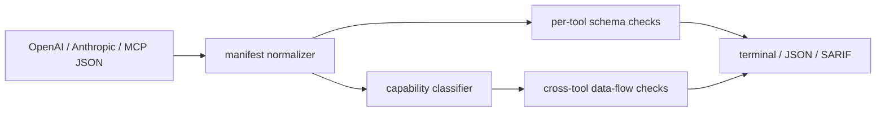

# agent-tool-audit

[](https://github.com/mertefekurt/agent-tool-audit/actions/workflows/ci.yml)
[](https://www.python.org/)
[](LICENSE)

**Review what an agent can do before reviewing what it did.**

`agent-tool-audit` inspects tool manifests for schema weaknesses, high-impact capabilities, and
dangerous capability combinations. It works locally on OpenAI, Anthropic, MCP, and plain function
definitions—without calling a model or uploading tool descriptions.

```text
CRITICAL ATA301 [read_environment_secret + send_webhook]
         toolset combines secret access with outbound data transfer
         fix: separate these capabilities or enforce a destination and data-flow policy

CRITICAL ATA201 [run_shell]
         tool exposes code or shell execution to the model
         fix: replace arbitrary execution with narrow, named operations or isolate it in a sandbox
```

## Why it is useful

Agent safety starts in the tool contract. A well-behaved model can still be given an unrestricted
shell command, an arbitrary webhook destination, or the exact pair of tools needed to read and
exfiltrate a credential. This CLI makes those design risks visible in code review and CI.

Key checks include:

- missing or vague tool descriptions
- permissive JSON Schemas and optional high-impact arguments
- free-form commands, destinations, and action selectors
- execution, secret access, destructive actions, and financial mutations
- cross-tool paths such as secret access plus outbound transfer
- duplicate names across combined manifests

Findings are deterministic, explainable, and include a concrete remediation.

## Install

Python 3.11 or newer is required.

```bash
git clone https://github.com/mertefekurt/agent-tool-audit.git
cd agent-tool-audit
python -m venv .venv
source .venv/bin/activate
python -m pip install -e .
```

For development:

```bash
python -m pip install -e ".[dev]"
```

## Audit a tool surface

Run the included risky manifest:

```bash
agent-tool-audit examples/risky-tools.json
```

Audit several manifests as one toolset:

```bash
agent-tool-audit agent-tools.json mcp-tools.json
```

Use it as a CI gate or create a code-scanning artifact:

```bash
agent-tool-audit tools.json --fail-on warning
agent-tool-audit tools.json --format json --output reports/tool-risk.json
agent-tool-audit tools.json --format sarif --output reports/tool-risk.sarif
```

A narrow example passes without suppressions:

```bash
agent-tool-audit examples/least-privilege-tools.json
```

## CLI

```text
usage: agent-tool-audit [-h] [--format {terminal,json,sarif}] [--output OUTPUT]
                        [--fail-on {warning,error,critical,none}]
                        [--ignore-rule RULE] [--version]
                        manifest [manifest ...]
```

Exit codes are `0` for a passing audit, `1` when the configured threshold is reached, and `2` for
invalid input or output errors. Repeat `--ignore-rule` for accepted findings that are controlled
outside the manifest.

## How it works



The normalizer converts supported dialects into one internal representation. Rule checks then
inspect individual schemas and the combined capability graph. The classifier is intentionally
keyword-based: results remain fast, offline, and reviewable rather than depending on another LLM.

## Tests

```bash
ruff check .
pytest
python -m agent_tool_audit --help
```

The suite covers dialect normalization, malformed inputs, schema rules, high-risk capabilities,
cross-tool findings, suppressions, reports, and CLI exit behavior.

## License

MIT
