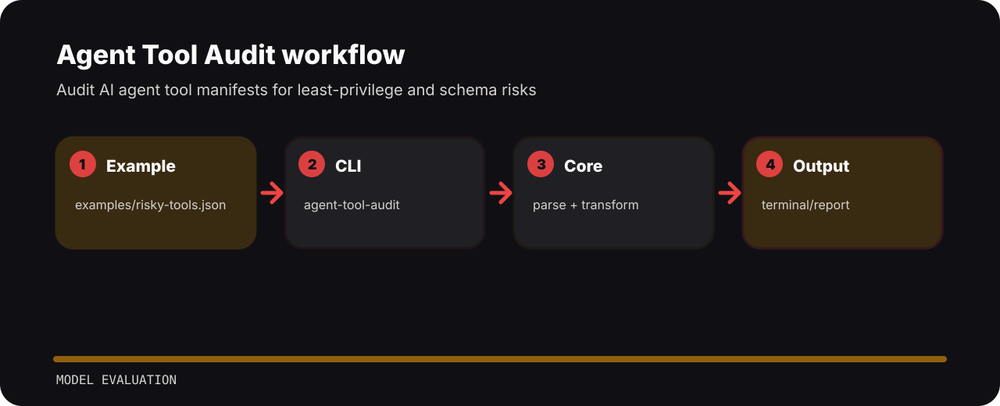

# Agent Tool Audit


Audit AI agent tool manifests for least-privilege and schema risks. It is a compact working note as much as a project: commands, file map, and the reasoning are kept close together.

| Detail | Value |
| --- | --- |
| Area | model evaluation |
| Entry | `agent-tool-audit` |
| Input | JSON document |
| Output | readable terminal output |

## Processing path



## First run

```bash
git clone https://github.com/mertefekurt/agent-tool-audit.git
cd agent-tool-audit
python -m pip install -e ".[dev]"
agent-tool-audit examples/risky-tools.json
```
