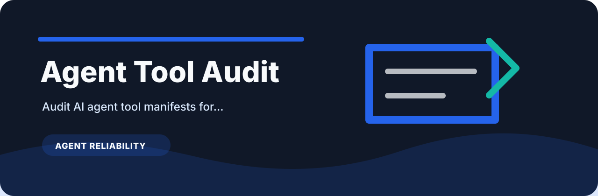

# Agent Tool Audit

Audit AI agent tool manifests for least-privilege and schema risks. I keep it small because this kind of check is most useful when it can run beside the work, not after the work has already shipped.



## Where it fits

- for model evaluation, traces, retrieval, and prompt review
- quick local checks without a service dependency
- review notes that should stay easy to reproduce

## Run it

```bash
git clone https://github.com/mertefekurt/agent-tool-audit.git
cd agent-tool-audit
python -m venv .venv
source .venv/bin/activate
python -m pip install -e ".[dev]"
agent-tool-audit examples/risky-tools.json
agent-tool-audit examples/risky-tools.json --json
```

## Project map

```text
.github/        CI workflow
examples/       sample inputs
src/            package source
tests/          test coverage
.gitignore      project file
pyproject.toml  package metadata
```
